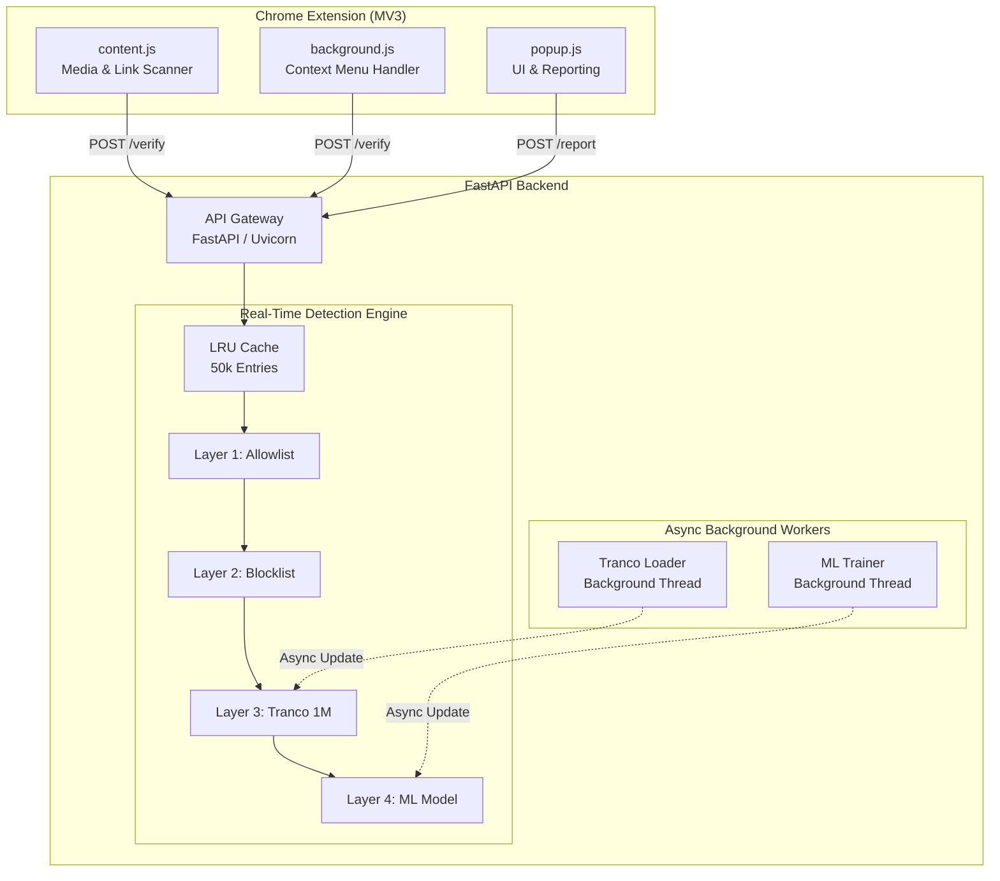
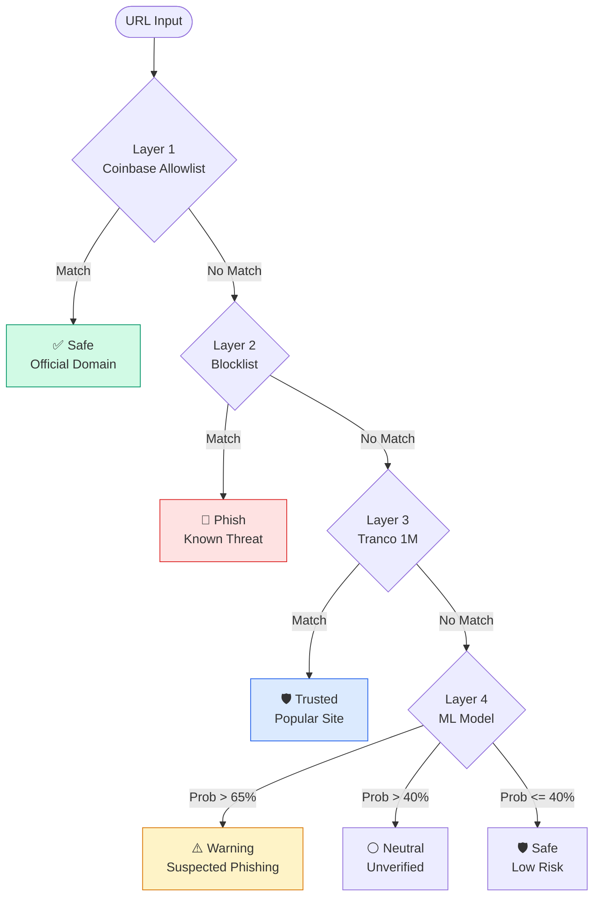

<div align="center">


# Phish-Guard

### Real-Time Phishing Detection for Coinbase Users

[](https://python.org)
[](https://fastapi.tiangolo.com)
[](https://developer.chrome.com/docs/extensions/mv3/)
[](https://scikit-learn.org)
[](LICENSE)

**A Chrome extension + FastAPI backend that verifies every link, image, and video you hover over — protecting Coinbase users from phishing attacks before they click.**

[Features](#-features) · [Architecture](#-architecture) · [Quick Start](#-quick-start) · [How It Works](#-how-it-works) · [API Reference](#-api-reference)

</div>

---

## 🎯 The Problem

Phishing attacks targeting crypto users cost billions annually. Attackers register lookalike domains (e.g., `coinbase-support.xyz`, `wallet-connect-base.org`) that are visually identical to the real thing. Users click, enter credentials, and lose funds.

**Phish-Guard solves this by verifying every link before you click it.**

---

## ✨ Features

| Feature | Description |
|---------|-------------|
| 🔗 **Link Scanning** | Every hyperlink on every page is scanned in real-time |
| 🖼️ **Image & Ad Scanning** | Images and videos wrapped in links are scanned too (Media Verification) |
| 📢 **iframe/Ad Detection** | Runs inside iframes — catches banner ads and embedded content |
| 🖱️ **Hover Badges** | Security status badge appears on hover — Green/Blue/Amber/Red |
| 🚨 **Right-Click Verify** | Right-click any link, image, or video to manually trigger verification |
| 📊 **Live Dashboard** | Real-time stats page showing engine status and domain counts |
| 🔴 **Report Threats** | One-click reporting from the popup — flags suspicious sites for review |
| ⚡ **LRU Cache** | 50,000-entry cache ensures repeated URLs are verified in microseconds |

---

## 🧠 Architecture

Phish-Guard uses a **Hybrid Async Architecture** to ensure zero latency for the user while handling heavy ML tasks in the background.



### Key Engineering Decisions
- **Async ML Training**: The RandomForest model trains on 235K URLs in a background daemon thread. The server starts instantly, and the ML layer activates seamlessly once training completes.
- **Lazy Scanning**: `IntersectionObserver` is used to only scan links and media elements when they enter the viewport, ensuring zero performance impact on heavy web pages.

---

## ⚡ Quick Start

### Prerequisites
- Python 3.9+
- Google Chrome or Brave browser

### 1. Clone the Repository

```bash
git clone https://github.com/shri-915/phish-guard.git
cd phish-guard
```

### 2. Start the Backend

```bash
./start_backend.sh
```

This script will:
- Create a Python virtual environment
- Install all dependencies automatically
- Start the FastAPI server at `http://localhost:8000`

> **First run note:** The ML model trains on 235K URLs in the background. The server is immediately available — ML kicks in after ~30-60 seconds.

### 3. Install the Chrome Extension

1. Open `chrome://extensions` in Chrome
2. Enable **Developer Mode** (top-right toggle)
3. Click **Load Unpacked**
4. Select the `extension/` folder

### 4. Browse & Stay Safe

Hover over any link, image, or video on any website. The Phish-Guard badge will appear showing the security status.

---

## 🔥 How It Works

### The 4-Layer Detection Engine

Every URL passes through a high-performance filtering pipeline:



### Badge Status Guide

| Badge | Status | Meaning |
|-------|--------|---------|
| ✅ Blue | `safe` | Official Coinbase domain (coinbase.com, base.org, etc.) |
| 🛡️ Green | `trusted` | Tranco Top 1M verified popular site (google.com, github.com) |
| ⚠️ Amber | `warning` | ML model flagged as likely phishing |
| 🚨 Red | `phish` | Known phishing domain — blocked |
| ⚪ Gray | `neutral` | Unverified — use caution |

---

## 📡 API Reference

### `POST /verify`
Verify a URL against all 4 detection layers.

**Request:**
```json
{ "url": "https://coinbase-support.xyz" }
```

**Response:**
```json
{
  "status": "phish",
  "message": "Known Phishing Domain",
  "confidence": 1.0,
  "badge": "red_alert"
}
```

### `POST /report`
Submit a user-reported threat.

**Request:**
```json
{ "url": "https://suspicious-site.com", "reason": "user_report" }
```

### `GET /api/stats`
Live engine statistics.

**Response:**
```json
{
  "trusted_domains": 1000044,
  "cached_predictions": 127,
  "blocklist_size": 8,
  "model_status": "active"
}
```

### `GET /health`
Health check endpoint.

```json
{ "status": "ok", "message": "Phish-Guard is running" }
```

### `GET /docs`
Interactive Swagger API documentation (auto-generated by FastAPI).

---

## 📁 Project Structure

```
phish-guard/
├── backend/
│   ├── main.py                    # FastAPI app, async entry point
│   ├── phishing_detector.py       # 4-layer engine logic
│   ├── ml_model.py                # Async ML training logic
│   ├── requirements.txt           # Python dependencies
│   └── static/                    # Landing page assets
│   └── datasets/
│       ├── PhiUSIIL_Phishing_URL_Dataset.csv   # 235K URLs
│       └── top-1m.csv             # Tranco Top 1M list
│
├── extension/
│   ├── manifest.json              # Chrome MV3 manifest (v1.1)
│   ├── content.js                 # Media/Link scanner (IntersectionObserver)
│   ├── background.js              # Service worker
│   ├── popup.html                 # UI
│   └── icons/                     # Generated logos
│
├── docs/                          # GitHub Pages static site
├── start_backend.sh               # Robust startup script
└── README.md
```

---

## 🛡️ Security & Privacy

- **No data stored**: URLs are checked in-memory and never logged to disk.
- **Local backend**: All processing happens on your machine — nothing sent to third-party servers.
- **CORS restricted**: The backend only accepts connections from the local extension (configurable).
- **Open source**: Full source available for audit.

> **Production note:** For deployment, restrict CORS origins and consider URL hashing for additional privacy.

---

## 🔭 Roadmap

- [ ] **Phase 4**: Real-time blocklist sync from threat intelligence feeds (PhishTank, OpenPhish)
- [ ] **Phase 5**: URL hashing for privacy-preserving cloud verification
- [ ] **Phase 6**: Firefox extension support
- [ ] **Phase 7**: Community-contributed blocklist with upvoting

---

## 🧰 Tech Stack

| Component | Technology |
|-----------|-----------|
| Backend | Python, FastAPI, Uvicorn |
| ML Model | scikit-learn (TF-IDF + RandomForest) |
| Dataset | PhiUSIIL (235K URLs), Tranco Top 1M |
| Extension | JavaScript, Chrome Manifest V3 |
| Frontend | HTML5, CSS3 (vanilla, no frameworks) |

---

## 👤 Author

**Shrimun Agarwal**
**Role:** Aspiring Data/ML Engineer @ Coinbase

> Built as a security tool showcase for Coinbase Trust & Safety.
> Not affiliated with Coinbase Inc.

---

<div align="center">

⭐ **Star this repo if Phish-Guard protected you!** ⭐

Made with ❤️ for the crypto community

</div>
